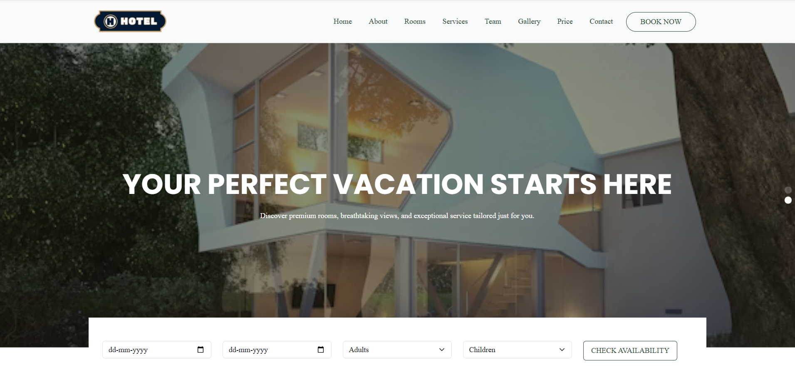
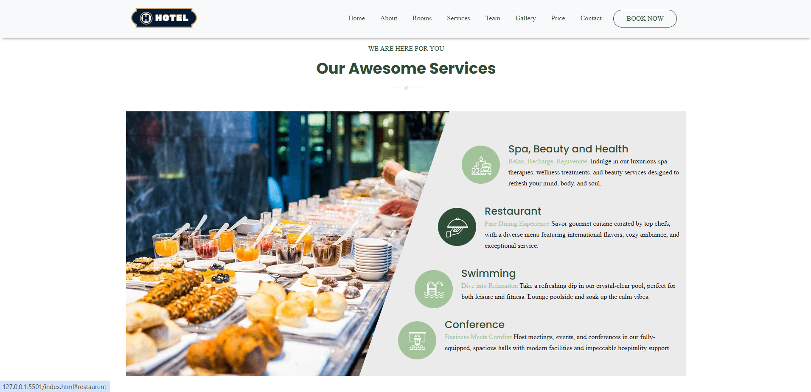
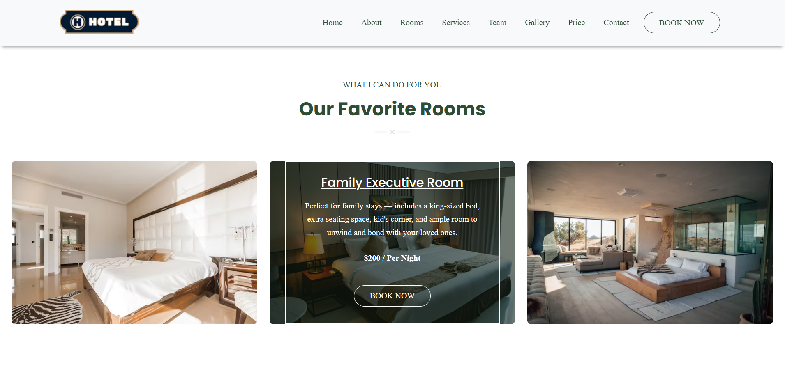

# 🌟 Hotel The Heaven Website

<p align="center">
  
  
  
  
  
</p>

---

## 🌍 Live Demo

🧑‍💻 **Check it Live Here**:  
🔗 [Insert Live Demo Link Here]

---

## 🖥️ Project Overview

This is the official website for **Hotel The Haven**, a luxurious hotel offering a serene and premium getaway experience. The website is designed to provide an engaging user experience with a focus on showcasing the hotel's rooms, services, team, gallery, and booking options. Key elements include:

- Elegant hero section with a slider showcasing hotel highlights
- Room and package showcases with pricing and booking options
- Services section highlighting spa, dining, swimming, and conference facilities
- Team and gallery sections for a personalized touch
- Responsive design for seamless browsing on all devices
- Interactive counters for hotel stats (clients, ratings, etc.)
- Contact and newsletter subscription for user engagement

---

## 🚀 Features

- 🏨 **Hero Slider** with Swiper.js for dynamic visuals and captions
- 🛏️ **Rooms & Packages Section** with hover effects and booking buttons
- 💆 **Services Section** with icons and detailed descriptions
- 👥 **Team Section** with social media links and hover animations
- 📸 **Gallery Section** with interactive image overlays
- 📊 **Counter Section** showcasing hotel achievements with animated numbers
- 📧 **Contact & Newsletter** for inquiries and subscriptions
- 🌐 Fully **responsive design** optimized for mobile, tablet, and desktop
- 🎨 **Modern UI** with glassmorphism, hover effects, and smooth transitions

---

## 🛠️ Tools & Technologies Used

<p align="center">
  
  
  
  
  
  
</p>

---

## 📸 Screenshots

<div align="center">
  
  
  
  
</div>

---

## 🚀 Getting Started Locally

Follow these steps to run the project locally on your machine:

### 1️⃣ Clone the Repository
```bash
git clone https://github.com/your-username/Hotel-The-Heaven.git
```
### 2️⃣ Navigate to the Project Folder
```bash
cd Hotel-The-Heaven
```
### 3️⃣ Open the Project
Since this is a static website, you can open index.html directly in a browser .

### 4️⃣ Dependencies
Ensure you have an internet connection to load external libraries (Swiper.js, Font Awesome, Google Fonts, etc.).<br>
No additional installations are required for this static site.

---

## 📌 Notes
🧪 This project is a frontend-only website built to showcase a hotel's services and branding. <br>
🔗 External assets like images (title-icon.webp, counter-bg.webp, etc.) need to be hosted or replaced with valid paths.<br>

⚠️ Replace placeholder image paths and social media links in index.html with actual links before deployment.<br>

🌐 The website uses Swiper.js for the hero slider and Font Awesome for icons, loaded via CDN.


